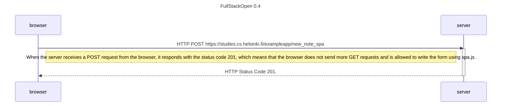

```mermaid

sequenceDiagram
    title FullStackOpen 0.4
    participant browser
    participant server

    browser->>server: HTTP POST https://studies.cs.helsinki.fi/exampleapp/new_note_spa
    activate server
        Note right of browser: When the server receives a POST request from the browser, it responds with the status code 201, which means that the browser does not send more GET requests and is allowed to write the form using spa.js.
    server-->>browser: HTTP Status Code 201.
    deactivate server
```
